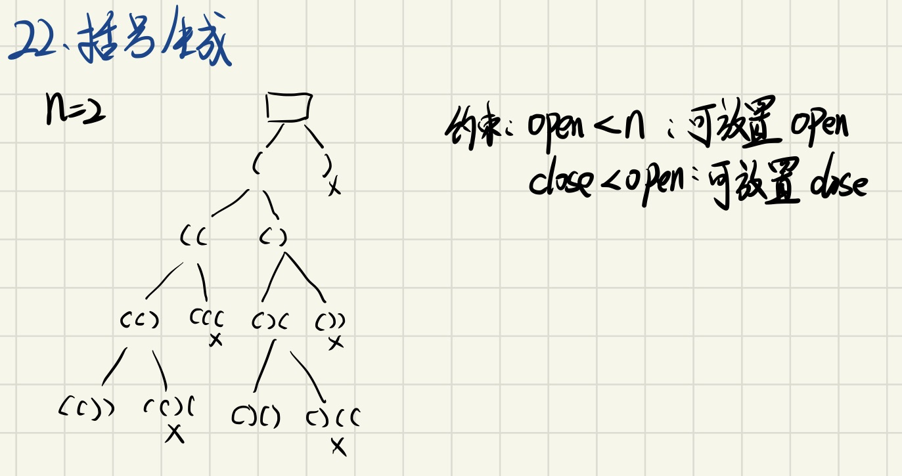

#### [22. 括号生成](https://leetcode-cn.com/problems/generate-parentheses/)

> #回溯法

数字 `n` 代表生成括号的对数，请你设计一个函数，用于能够生成所有可能的并且 **有效的** 括号组合。

 

**示例 1：**

```
输入：n = 3
输出：["((()))","(()())","(())()","()(())","()()()"]
```

**示例 2：**

```
输入：n = 1
输出：["()"]
```

 

**提示：**

- `1 <= n <= 8`

# 解题

## 方法一：暴力法

- 使用枚举法遍历所有的情况
- 然后对每个检查是否有效

#### 时间复杂度：$O(2^2n·n)$

## 方法二：回溯剪枝

### 1. 思路

使用回溯法在约束条件下剪枝，减少时间复杂度




### 2 编程

#### 2.1 数据结构

`vector<string> result;`：存储返回结果

`string current;`：临时变量，用于暂存字符串（数组）

- push和pop平衡，充分重用了该临时变量

#### 2.2 算法流程

0. 初始化ans变量，临时存储str的变量
1. 进入回溯子函数
   - 如果括号长度达到，这次字符串记录到ans中
   - 当前状况如果满足约束：open<n，可以放置左括号（open)
   - 当前状况如果满足约束：close<open，可以放置右括号（close)
2. 完整执行完回溯函数后，返回ans

#### 2.3 代码实现

**子函数：回溯剪枝**

```c++
void backtrack(vector<string> &ans, string &cur, int n, int open, int close) {
    if (cur.size() == n * 2) {
        ans.push_back(cur);
    }
    if (open < n) {
        cur.push_back('(');
        backtrack(ans, cur, n, open + 1, close);
        cur.pop_back();
    }
    if (close < open) {
        cur.push_back(')');
        backtrack(ans, cur, n, open, close + 1);
        cur.pop_back();
    }
}
```

**主函数**

```c++
vector<string> generateParenthesis(int n) {
    vector<string> result;
    string current;
    backtrack(result, current, n, 0, 0);
    return result;
}
```


### 3 复杂度分析

# 总结

- `string &cur`隐含了深度t的信息

- 代码重构：临时存储str的变量可以在python的形参中直接使用[]来体现。

  ```python
  cur = []
  def traceback(open: int, close: int):
  # 可以改成：
  def traceback(cur=[], open: int, close: int):
  ```

  
