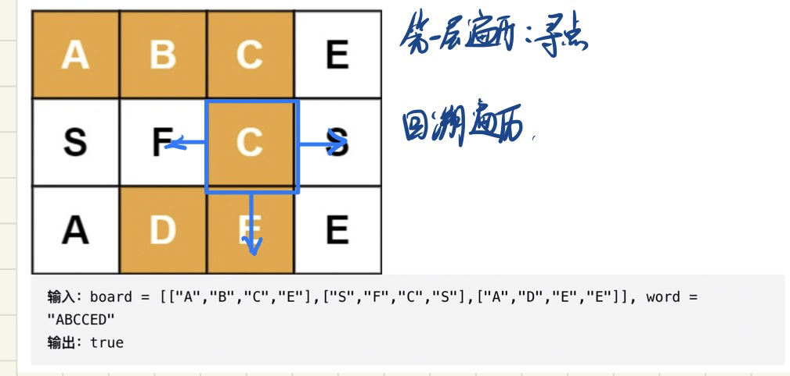

#### [79. 单词搜索](https://leetcode-cn.com/problems/word-search/)

> #回溯 #深度搜索

给定一个 `m x n` 二维字符网格 `board` 和一个字符串单词 `word` 。如果 `word` 存在于网格中，返回 `true` ；否则，返回 `false` 。

单词必须按照字母顺序，通过相邻的单元格内的字母构成，其中“相邻”单元格是那些水平相邻或垂直相邻的单元格。同一个单元格内的字母不允许被重复使用。

 

**示例 1：**


```
输入：board = [["A","B","C","E"],["S","F","C","S"],["A","D","E","E"]], word = "ABCCED"
输出：true
```

**示例 2：**


```
输入：board = [["A","B","C","E"],["S","F","C","S"],["A","D","E","E"]], word = "SEE"
输出：true
```

**示例 3：**


```
输入：board = [["A","B","C","E"],["S","F","C","S"],["A","D","E","E"]], word = "ABCB"
输出：false
```

 

**提示：**

- `m == board.length`
- `n = board[i].length`
- `1 <= m, n <= 6`
- `1 <= word.length <= 15`
- `board` 和 `word` 仅由大小写英文字母组成


# 解题

## 方法一：回溯法

### 1. 思路



- 使用check子算法来表示从网格(i, j)位置出发，能否搜索到

设网格(i, j)位置出发，

- 对于每个网格都进行check回溯子算法的遍历


### 2 编程

#### 2.1 数据结构

`vector<vector<int>> visited(h, vector<int>(w));`：标志每个位置是否被访问过🐱

- 临时变量重用：如果在每次进入check函数的时候，设置true的同时在尾部设置false就能平衡这个临时变量。

#### 2.2 算法流程

##### 主函数

对于所有的字母都进行遍历，执行check递归子函数。如果搜索成功就返回true

##### 递归子函数★

> check(*i*,*j*,*k*) 表示判断以网格的 (i,j)位置出发，能否搜索到单词 word[k..]

- 结束条件
  - 遍历到所有字母（遍历的深度=单词长度）return true
  - 如果单词位置不匹配 return false（剪枝）

- 否则，遍历当前位置的所有相邻位置使用回溯

  > 需要维护一个visited数组来标识每个位置是否被访问过

#### 2.3 代码实现

主函数：每个单词开始的遍历

```C++
bool exist(vector<vector<char>> &board, string word) {
    int h = board.size();
    int w = board[0].size();
    vector<vector<int>> visited(h, vector<int>(w));
    for (int i = 0; i < h; ++i) {
        for (int j = 0; j < w; ++j) {
            bool falg = check(visited, board, word, i, j, 0);
            if (falg) return true;
        }
    }
    return false;
}
```

子函数

```c++
	/**
     * 递归子算法：递归检查该位置的字母是否和目标单词相同
     * @param visited 临时变量，标志是否被访问过
     * @param k 递归深度
     * @return
     */
bool check(vector<vector<int>> &visited, vector<vector<char>> &board, string &word, int i, int j, int k) {
    if (board[i][j] != word[k]) {
        return false;
    } else if (k == word.size() - 1) {
        return true;
    }
    visited[i][j] = true;
    bool result = false;
    vector<pair<int, int>> directions{{0,  1},{1,  0},{-1, 0},{0,  -1}};
    for (auto dir: directions) {
        int newi = i + dir.first;
        int newj = j + dir.second;
        if (newi >= 0 && newi < board.size() && newj >= 0 && newj < board[0].size()) {
            if (visited[newi][newj] == false) {
                bool flag = check(visited, board, word, newi, newj, k + 1);
                if (flag) {
                    result = true;
                    break;
                }
            }
        }
    }
    visited[i][j] = false;
    return result;
}
```


### 3 复杂度分析

- 空间复杂度：*O*(MN⋅3^L)
  - *L* 为字符串 word*word*的长度，因为走过

- 空间复杂度：O(MN)
  - 额外开辟了 O(MN) 的 visited*visited* 数组
  - 栈的深度最大为 O(min⁡(L,MN))

# 总结

- vector初始化值为0：`vector<in> v(10);`

- 类似《岛的数量》的主要逻辑
  - DFS和回溯的关系：具有**限界函数**的**深度优先**的**生成法**称为回溯法
- 用到了回溯法常用的临时变量的存储
  - 压入的对应弹出，这样变量能被重复利用