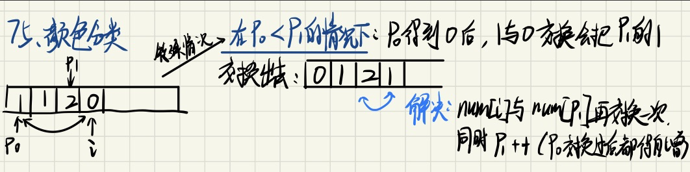

#### [75. 颜色分类](https://leetcode-cn.com/problems/sort-colors/)

> #排序 #指针 #遍历

给定一个包含红色、白色和蓝色、共 `n` 个元素的数组 `nums` ，**[原地](https://baike.baidu.com/item/原地算法)**对它们进行排序，使得相同颜色的元素相邻，并按照红色、白色、蓝色顺序排列。

我们使用整数 `0`、 `1` 和 `2` 分别表示红色、白色和蓝色。


必须在不使用库的sort函数的情况下解决这个问题。 

**示例 1：**

```
输入：nums = [2,0,2,1,1,0]
输出：[0,0,1,1,2,2]
```

**示例 2：**

```
输入：nums = [2,0,1]
输出：[0,1,2]
```

 

**提示：**

- `n == nums.length`
- `1 <= n <= 300`
- `nums[i]` 为 `0`、`1` 或 `2`

 

**进阶：**

- 你可以不使用代码库中的排序函数来解决这道题吗？
- 你能想出一个仅使用常数空间的一趟扫描算法吗？


# 解题

## 方法一：单指针

### 1. 思路

- 对数组进行两次遍历
  - 第一次遍历将数组中所有的 0 交换到数组的头部
  - 第二次遍历将数组中所有的 1 交换到头部的 0 之后


### 2 编程

#### 2.1 数据结构

`int ptr = 0;`:表示数组nums从位置0到位置ptr-1都属于头部

#### 2.2 代码实现

```c++
void sortColors(vector<int> &nums) {
    int ptr = 0;
    int n = nums.size();
    for (int i = 0; i < n; ++i) {
        if (nums[i] == 0) {
            swap(nums[ptr], nums[i]);
            ptr++;
        }
    }
    for (int i = ptr; i < n; ++i) {
        if (nums[i] == 1) {
            swap(nums[ptr], nums[i]);
            ptr++;
        }
    }
}
```

### 3 复杂度分析

- 时间复杂度：O(n)

- 空间复杂度：O(1)

  

## 方法二：双指针

> 方法一的改进，可以仅用一次遍历

### 1. 思路

使用p0和p1两个指针，当遍历整个数组时：

- 如果找到了1，那么将其与nums[p1]进行交换，并p1向后移动一个位置
- 如果找到了0，那么将其与nums[p0]进行交换：
  - ★如果出现p0<p1的情况（如下图），需要将nums[i]和nums[p1]再进行交换
  - p1和p2都要自增1




### 2 编程

#### 2.1 数据结构

`int ptr0 = 0, ptr1 = 0;`

- 表示数组nums从位置0到位置ptr0-1都属于0的头部
- 表示数组nums从位置0到位置ptr1-1都属于1的头部

#### 2.2 算法流程

见思路

#### 2.3 代码实现

```C++
void sortColors2(vector<int> &nums) {
    int ptr0 = 0, ptr1 = 0;
    int n = nums.size();
    for (int i = 0; i < n; ++i) {
        if (nums[i] == 1) {
            swap(nums[ptr1], nums[i]);
            ptr1++;
        }
        if (nums[i] == 0) {
            swap(nums[ptr0], nums[i]);
            if (ptr0 < ptr1) {
                swap(nums[ptr1], nums[i]);
            }
            ptr0++;
            ptr1++;
        }
    }
}
```


### 3 复杂度分析

- 时间复杂度：O(n)
- 空间复杂度：O(1)


# 总结

- python两个数交换：`nums[i], nums[p1] = nums[p1], nums[i]`