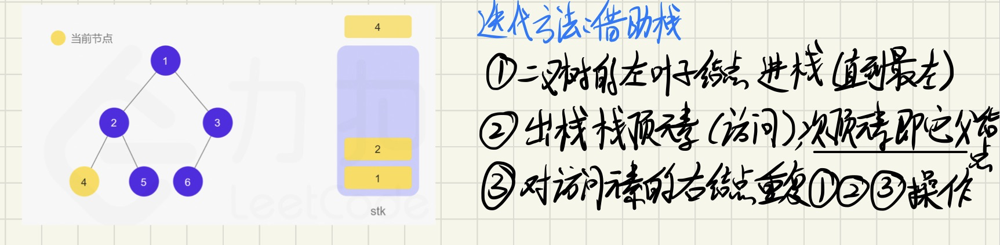

#### [94. 二叉树的中序遍历](https://leetcode-cn.com/problems/binary-tree-inorder-traversal/)

> #中序遍历 #迭代 #递归 #二叉树

给定一个二叉树的根节点 `root` ，返回 *它的 **中序** 遍历* 。

 

**示例 1：**


```
输入：root = [1,null,2,3]
输出：[1,3,2]
```

**示例 2：**

```
输入：root = []
输出：[]
```

**示例 3：**

```
输入：root = [1]
输出：[1]
```

# 解题

## 方法一：递归

## 方法二：迭代

### 1. 思路




### 2 编程

#### 2.1 数据结构

#### 2.2 算法流程

#### 2.3 代码实现


### 3 复杂度分析


# 总结

- 迭代法的循环条件设计`while (root != nullptr || !stk.empty()) {`
  - 第一次进入循环时，栈为空
  - 遍历到最后一个元素时，节点为空，同时栈为空